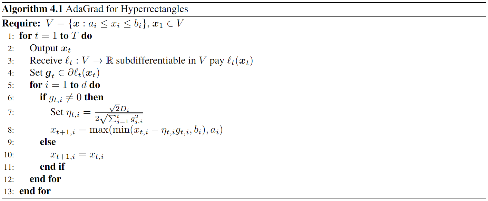

A monograph on online learning by Francesco Orabona.
<!--more-->

# OSD for Strongly Convex Losses
## Theorem 1.1
Let $V$ a non-empty closed convex set in $\mathbb{R}^d$. Assume that the functions $\ell_t:V\rightarrow \mathbb{R}$ are $\mu_t$-strongly convex w.r.t $\|\cdot\|_2$ and subdifferentiable in $V$, where $\mu_t > 0$. Use OSD with stepsizes equal to $\eta_t = \frac{1}{\sum_{i=1}^t \mu_i}$. Then, for any $u\in V$, we have the following regret guarantee

$$
\begin{equation*}
\sum_{t=1}^T\ell_t(x_t) - \sum_{t=1}^T\ell_t(u) \leqslant \frac{1}{2}\sum_{t=1}^T\frac{\|g_t\|_2^2}{\sum_{i=1}^t\mu_i}\;.
\end{equation*}
$$

Proof:

From the $\mu_t$-strong convexity of $\ell_t$ we have

$$
\begin{equation}
\ell_t(x_t)-\ell_t(u) \leqslant \langle g_t, x_t-u\rangle - \frac{\mu_t}{2}\|x_t-u\|_2^2\;.
\end{equation}
$$

also have

$$
\begin{equation}
\eta_t\left( \ell_t(x_t) - \ell_t(u) \right) \leqslant \eta_t\langle g_t, x_t-u\rangle \leqslant \frac{1}{2}\|x_t-u\|_2^2 - \frac{1}{2}\|x_{t+1}-u\|_2^2 + \frac{\eta_t^2}{2}\|g_t\|_2^2\;.
\end{equation}
$$

and from the fact that $\eta_t = \frac{1}{\sum_{i=1}^t\mu_i}$, we have

$$
\begin{align*}
\frac{1}{2\eta_1}-\frac{\mu_1}{2} &= 0\;,\\
\frac{1}{2\eta_t}-\frac{\mu_t}{2} &= \frac{1}{2\eta_{t-1}}\,\text{ for $t\geqslant 2\;.$}
\end{align*}
$$

So use the above equation (1) and (2), we have

$$
\begin{align*}
\sum_{t=1}^T\left( \ell_t(x_t)-\ell_t(u) \right) &\leqslant \sum_{t=1}^T\left( \frac{1}{2\eta_t}\|x_t-u\|_2^2 - \frac{1}{2\eta_t}\|x_{t+1}-u\|_2^2 -\frac{\mu_t}{2}\|x_t-u\|_2^2 \right) + \sum_{t=1}^T\frac{\eta_t}{2}\|g_t\|_2^2\\
&= -2\eta_1\|x_2-u\|_2^2 +  \sum_{t=2}^T\left( \frac{1}{2\eta_{t-1}}\|x_t-u\|_2^2 - \frac{1}{2\eta_t}\|x_{t+1}-u\|_2^2 \right) + \sum_{t=1}^T\frac{\eta_t}{2}\|g_t\|_2^2\\
&= -2\eta_{T}\|x_{T+1}-u\|_2^2 + \sum_{t=1}^T\frac{\eta_t}{2}\|g_t\|_2^2\\
&\leqslant \frac{1}{2}\sum_{t=1}^T\frac{\|g_t\|_2^2}{\sum_{i=1}^t\mu_i}\;.
\end{align*}
$$

Proof is done.

Let $\mu_t = \mu > 0$ and $\ell_t$ is L-Lipschitz w.r.t $\|\cdot\|_2$. Then we have

$$
\begin{equation*}
\sum_{t=1}^T\ell_t(x_t) - \sum_{t=1}^T\ell_t(u) \leqslant \frac{1}{2}\sum_{t=1}^T\frac{\|g_t\|_2^2}{\sum_{i=1}^t \mu_i} \leqslant \frac{L^2}{2\mu}\sum_{t=1}^T\frac{1}{t} \leqslant \frac{L^2}{2\mu}\left(1+\ln T\right) \;.
\end{equation*}
$$

# Adaptive Alogrithms: $L^*$ bounds and AdaGrad
## Adaptive Learning Rates for Online Subgradient Descent
### Lemma 2.1
Let $a_0 \geqslant 0$ and $f:[0,+\infty)\rightarrow[0,+\infty)$ a **nonincreasing** function. Then

$$
\begin{equation*}
\sum_{t=1}^T a_tf\left(a_0 + \sum_{i=1}^t a_i\right) \leqslant \int_{a_0}^{\sum_{t=0}^T a_t}f(x)\mathrm{d}x\;.
\end{equation*}
$$

Proof:

Denote by $s_t = \sum_{i=0}^t a_i$ ,

$$
\begin{equation*}
a_t f\left(a_0+\sum_{t=1}^t a_i\right) = a_t f(s_t) = \int_{s_{t-1}}^{s_t}f(s_t)\mathrm{d}x \leqslant \int_{s_{t-1}}^{s_t}f(x)\mathrm{d}x\;.
\end{equation*}
$$

Summing over $t$ we get the desired result.

### Minimization of the linear regret
From the previous results, we have

$$
\begin{equation*}
\sum_{t=1}^T\langle g_t, x_t\rangle -\sum_{t=1}^T \langle g_t, u\rangle = \sum_{t=1}^T\langle g_t, x_t-u\rangle \leqslant \frac{D^2}{2\eta_T} + \frac{1}{2}\sum_{t=1}^T \eta_t\|g_t\|_2^2\;.
\end{equation*}
$$

Fix the learning rate, we have

$$
\begin{equation*}
\eta_T^* = \frac{D}{\sqrt{\sum_{t=1}^T\|g_t\|_2^2}}\;,
\end{equation*}
$$

which gives the optimal linear regret.

with adaptive learning rate $\eta_t = \frac{D}{\sqrt{\sum_{i=1}^t\|g_i\|_2^2}}$ and use Lemma 2.1, we have

$$
\begin{align*}
\sum_{t=1}^T\langle g_t, x_t\rangle -\sum_{t=1}^T \langle g_t, u\rangle 
&\leqslant \frac{D^2}{2\eta_T} + \frac{1}{2}\sum_{t=1}^T \eta_t\|g_t\|_2^2\\
&= \frac{D}{2}\sqrt{\sum_{t=1}^T\|g_t\|_2^2} + \frac{D}{2}\sum_{t=1}^T\frac{\|g_t\|_2^2}{\sqrt{\sum_{i=1}^t\|g_i\|_2^2}}\\
&\leqslant \frac{D}{2}\sqrt{\sum_{t=1}^T\|g_t\|_2^2} + \frac{D}{2}\int_0^{\sum_{t=1}^T\|g_t\|_2^2}\frac{\mathrm{d}x}{\sqrt{x}}\\
&= \frac{D}{2}\sqrt{\sum_{t=1}^T\|g_t\|_2^2} + D\sqrt{\sum_{t=1}^T\|g_t\|_2^2}\\
&= \frac{3D}{2}\sqrt{\sum_{t=1}^T\|g_t\|_2^2}\;.
\end{align*}
$$

myltiply the learning rates by $\frac{\sqrt{2}}{2}$, then $\eta_t = \frac{\sqrt{2}D}{2\sqrt{\sum_{i=1}^t\|g_i\|_2^2}}$, we can improve the constant in front of the bound to $\sqrt{2}$.

### Theorem 2.2
Let $V\subseteq \mathbb{R}^d$ a closed non-empty convex set with diameter $D$, i.e., $\max_{x,y\in V}\|x-y\|_2 \leqslant D$. Let $\ell_1,\cdots,\ell_T$ an arbitrary sequence of convex functions $\ell_t:V\rightarrow \mathbb{R}$ subdifferentiable in $V$ for $t=1,\cdots,T$. Pick any $x_1\in V$, set $\eta_t = \frac{\sqrt{2}D}{2\sqrt{\sum_{i=1}^t\|g_i\|_2^2}}$, $t=1,\cdots,T$, and do not update on rounds when $g_t=0$. Then, $\forall u\in V$, the following regret bound holds

$$
\begin{equation*}
\mathcal{R}_T(u) = \sum_{t=1}^T\ell_t(x_t) - \sum_{t=1}^T\ell_t(u) \leqslant \sqrt{2}D\sqrt{\sum_{t=1}^T\|g_t\|_2^2} = \sqrt{2}\min_{\eta>0}\frac{D^2}{2\eta} + \frac{\eta}{2}\sum_{t=1}^T\|g_t\|_2^2\;.
\end{equation*}
$$

It shows that we get (almost, only a factor of $\sqrt{2}$ worse than) the optimal linear regret.

## Smooth Function
### Definition 2.3
(**Smooth Function**). Let $f:V\rightarrow \mathbb{R}$ differentiable in an open set containing $V$. We say that $f$ is $M$-smooth w.r.t $\|\cdot\|_2$ if $\|\nabla f(x) - \nabla f(y)\|_* \leqslant M\|x-y\|$ for all $x, y\in V$.

### Lemma 2.4
Let $f:V\rightarrow \mathbb{R}$ be $M$-smooth. Then, for any $x,y\in V$, we have

$$
\begin{equation*}
\lvert f(y) - f(x) - \langle \nabla f(x), y-x\rangle \rvert \leqslant \frac{M}{2}\|x-y\|_2^2\;.
\end{equation*}
$$

Proof:

By the definition of $M$-smooth function, $\nabla f:V\rightarrow \mathbb{R}^d$ is Lipschitz and so continuous, we have

$$
\begin{align*}
f(y) &= f(x) + \int_x^y\nabla f(t)\mathrm{d}t\\
&= f(x) + \int_0^1 \langle \nabla f\left(x+\tau(y-x)\right), y-x \rangle\mathrm{d}\tau\\
&= f(x) + \langle \nabla f(x), y-x\rangle + \int_0^1 \langle \nabla f\left(x+\tau(y-x)\right) - \nabla f(x), y-x \rangle\mathrm{d}\tau\;.
\end{align*}
$$

Therefore,

$$
\begin{align*}
\lvert f(y) - f(x) - \langle \nabla f(x), y-x\rangle \rvert &= \left\lvert \int_0^1 \langle \nabla f\left(x+\tau(y-x)\right) - \nabla f(x), y-x \rangle\mathrm{d}\tau \right\rvert\\
&\leqslant \int_0^1 \lvert \langle \nabla f\left(x+\tau(y-x)\right) - \nabla f(x), y-x \rangle \rvert\mathrm{d}\tau\\
&\leqslant \int_0^1 \|\nabla f\left(x+\tau(y-x)\right) - \nabla f(x)\|_*\|y-x\|\mathrm{d}\tau\\
&\leqslant \int_0^1 \tau M\|y-x\|^2\mathrm{d}\tau\\
&= \frac{M}{2}\|y-x\|^2\;.
\end{align*}
$$

So, a smooth function can be upper and lower bounded by a quadratic function.

### Theorem 2.5
Let $f:\mathbb{R}^d \rightarrow \mathbb{R}$ be $M$-smooth and bounded from below, then for all $x\in \mathbb{R}$

$$
\begin{equation*}
\|\nabla f(x)\|_*^2 \leqslant 2M\left( f(x) - \inf_{y\in \mathbb{R}^d}f(y) \right)\;.
\end{equation*}
$$

Proof:

From Lemma 2.4, for any $x, v\in \mathbb{R}^d$, we have the left inequality, the right inequality is trivial.

$$
\begin{equation}
\langle -\nabla f(x), v\rangle - \frac{M}{2}\|v\|^2 \leqslant f(x) - f(x+v) \leqslant f(x) - \inf_{y\in \mathbb{R}^d}f(y)\;.
\end{equation}
$$

Let $g(x) = \frac{1}{2}\|x\|^2$, we have $g^*(\theta) = \frac{1}{2}\|\theta\|_*^2$ , then

$$
\begin{equation*}
\frac{1}{2}\|-\frac{\nabla f(x)}{M}\|_*^2 = \frac{1}{2M^2}\|\nabla f(x)\|_*^2 = \sup_{v} \langle -\frac{\nabla f(x)}{M}, v \rangle - \frac{1}{2}\|v\|^2\;,
\end{equation*}
$$

multiply $M$ on both sides, we have

$$
\begin{equation}
\frac{1}{2M}\|\nabla f(x)\|_*^2 = \sup_{v} \langle -\nabla f(x), v \rangle - \frac{M}{2}\|v\|^2\;.
\end{equation}
$$

Combine the equation (3) and (4), we get the desired result.

## $L^*$ bounds
This section will introduce the \(L^*\) bounds, that depend on the cumulative competitor loss that is usually denoted by \(L^*\).

Assume that the loss functions \(\ell_1,\cdots,\ell_T\) are bounded from below (without loss of generality, we can assume that \(\inf_{x\in V}\ell_t(x) = 0\)) and \(M\)-smooth on an open sets that includes \(V\). Then, from the last blog and Theorem 2.5, we have

$$
\begin{align*}
\sum_{t=1}^T \left(\ell_t(x_t)-\ell_t(u) \right) &\leqslant \frac{\|u-x_1\|_2^2}{2\eta} + \eta \sum{t=1}^T M\ell_t(x_t)\;,\\
\sum_{t=1}^T \left(\ell_t(x_t)-\ell_t(u) \right) &\leqslant \frac{\eta M}{1-\eta M}\sum_{t=1}^T \ell_t(u) + \frac{\|u-x_1\|_2^2}{2\eta(1-\eta M)}\;. \tag{reordered}
\end{align*}
$$

Simplify this regret upper bound with assumption that \(\eta \leqslant \frac{1}{2M}\), we have

$$
\begin{equation*}
\sum_{t=1}^T \left(\ell_t(x_t)-\ell_t(u) \right) \leqslant 2\eta M\sum_{t=1}^T \ell_t(u) + \frac{\|u-x_1\|_2^2}{\eta}\;.
\end{equation*}
$$

It's interesting that a fixed learning rate that deponds only on \(M\) can achieve a vanishing average regret if there exists a competitor \(u\in V\) whose cumulative loss grows sublinearly.

However, we can do better. For a fixed \(u\in V\), setting \(\eta = \min\left(\frac{1}{\sqrt{2M\sum_{t=1}^T\ell_t(u)}}, \frac{1}{2M} \right) \), then

$$
\begin{align*}
&\sum_{t=1}^T \left(\ell_t(x_t)-\ell_t(u) \right)\\
&\leqslant 2\eta M\sum_{t=1}^T \ell_t(u) + \frac{\|u-x_1\|_2^2}{\eta}\\
&= \min\left(\sqrt{2M\sum_{t=1}^T\ell_t(u)}, \sum_{t=1}^T\ell_t(u) \right) + \|u-x_1\|_2^2\max\left(\sqrt{2M\sum_{t=1}^T\ell_t(u)}, 2M \right)\\
&\leqslant \left(\|u-x_1\|_2^2 + 1 \right)\max\left(\sqrt{2M\sum_{t=1}^T\ell_t(u)}, 2M \right)\;.
\end{align*}
$$

We see that here the dependency is on \(\sqrt{\sum_{t=1}^T\ell_t(u)} \) instead of \(\sqrt{T}\). The regret is upper bounded by a constant if the cumulative loss of the competitor is 0. However, this result requires the knowledge of the future through the cumulative loss of the competitor. We can easily get rid of it with a different choice of the learning rate.

From Theorem 2.2 and 2.5, we immediately get

$$
\begin{equation*}
\mathcal{R}_T(u) = \sum_{t=1}^T\ell_t(x_t) - \sum_{t=1}^T\ell_t(u) \leqslant 2D\sqrt{M\sum_{t=1}^T\ell_t(x_t)}\;,
\end{equation*}
$$

which can be upper bound by a simply lemma 2.6, that is Theorem 2.7.

### Lemma 2.6
Let \(a, c > 0, b \geqslant 0, \) and \(x \geqslant 0\) such that \(x-\sqrt{ax+b}\leqslant c \). Then \(x\leqslant a+c+2\sqrt{b+ac}\).

(Hint: use \(\sqrt{x+y} \leqslant \sqrt{x} + \sqrt{y} \))

### Theorem 2.7
Let $V\subseteq \mathbb{R}^d$ a closed non-empty convex set with diameter $D$. Let $\ell_1,\cdots,\ell_T$ an arbitrary sequence of non-negative convex functions $\ell_t:V\rightarrow \mathbb{R}\;M$-smooth in open sets containing $V$ for $t=1,\cdots,T$. Pick any $x_1\in V$, set $\eta_t = \frac{\sqrt{2}D}{2\sqrt{\sum_{i=1}^t\|g_i\|_2^2}},t=1,\cdots,T$, and do not update on rounds when $g_t=0$. Then, $\forall u\in V$, the following regret bound holds

$$
\begin{equation*}
\mathcal{R}_T(u) = \sum_{t=1}^T\ell_t(x_t) - \sum_{t=1}^T\ell_t(u) \leqslant 4MD^2 + 4D\sqrt{M\sum_{t=1}^T\ell_t(u)}\;.
\end{equation*}
$$

## AdaGrad
This section will present a proof that only allows hyperrectangles as feasible sets \(V\), on the other hand the restriction makes the proof almost trivial.

AdaGrad has key ingredients:
- A coordinate-wise learning process;
- The adaptive learning rates \(\eta_t = \frac{D}{\sqrt{\sum_{i=1}^t\|g_i\|_2^2}} \)

Let's see the first ingredient. We have

$$
\begin{align*}
&\sum_{t=1}^T\ell_t(x_t) - \sum_{t=1}^T\ell_t(u)\\
&\leqslant \sum_{t=1}^T\langle g_t, x_t \rangle - \langle g_t,  u\rangle\\
&= \sum_{t=1}^T\sum_{i=1}^d g_{t,i}x_{t,i} - \sum_{t=1}^T\sum_{i=1}^d g_{t,i}u_i\\
&= \sum_{i=1}^d\left( \sum_{t=1}^T g_{t,i}x_{t,i} - \sum_{t=1}^T g_{t,i}u_i \right)\\
&=\sum_{i=1}^d \mathcal{R}_{T,i}(u_i)\;,
\end{align*}
$$

where we denoted by \(\mathcal{R}_{T,i}(u_i) \) the regret of the 1-d OLO problem over coordinate $i$.

Specializing the regret in Theorem 2.2 to the 1-d case, we have

$$
\begin{equation*}
\sum_{t=1}^Tg_{t,i}x_{t,i} - \sum_{t=1}^Tg_{t,i}u_i \leqslant \sqrt{2}D_i\sqrt{\sum_{t=1}^Tg_{t,i}^2}\;.
\end{equation*}
$$

This choice gives us the AdaGrad algorithm.

Summing over \(i\), we get the following regret bound

### Theorem 2.8
Let \(V = \{x:a_i \leqslant x_i \leqslant b_i\} \) with diameters along each coordinate \(D_i = b_i-a_i\). Let \(\ell_1,\cdots,\ell_T\) an arbitrary sequence of convex functions \(\ell_t:V\rightarrow \mathbb{R}\) subdifferentiable in \(V\) for \(t=1,\cdots,T\). Pick any \(x_1\in V\), set \(\eta_{t,i} = \frac{\sqrt{2}D_i}{2\sqrt{\sum_{j=1}^tg_{j,i}^2}},t=1,\cdots,T \). Then, \(\forall u\in V\), the following regret bound holds

$$
\begin{equation*}
\mathcal{R}_T(u) = \sum_{t=1}^T\ell_t(x_t) - \sum_{t=1}^T\ell_t(u) \leqslant \sqrt{2}\sum_{i=1}^dD_i\sqrt{\sum_{t=1}^Tg_{t,i}^2}\;.
\end{equation*}
$$

In fact, it's a better regret bound compared to Theorem 2.2 when \(V\) is a hyperrectangle. Just use Cauchy-Schwarz inequality, we have

$$
\begin{equation*}
\sum_{i=1}^d D_i\sqrt{\sum_{t=1}^Tg_{t,i}^2} \leqslant D\sqrt{\sum_{t=1}^T \|g_t\|_2^2}\;.
\end{equation*}
$$

Also, note that

$$
\begin{equation*}
\sqrt{\sum_{t=1}^T \|g_t\|_2^2} \leqslant \sum_{i=1}^d\sqrt{\sum_{t=1}^T\|g_{t,i}\|_2^2} \leqslant \sqrt{d}\sqrt{\sum_{t=1}^T\|g_t\|_2^2}\;,
\end{equation*}
$$

where we use the fact that \(L_2\) norm is bigger than the \(L_2\), and Cauthy-Schwarz inequality. So, in the case that \(V\) is a hypercude we have \(D_i = D_\infty = \max_{x,y}\|x-y\|_\infty \) and \(D = \sqrt{d}D_\infty \), the bound of Adagrad is between \(\frac{1}{d}\) and 1 times the bound of Theorem 2.2.